# ReviewOMG SEO 集群思维导图

> 给 SEO 新手看的版本：**集群页 / Hub Page** 就像一个专题首页，负责承接大关键词；**博客页 / Supporting Blog** 就像专题下面的小文章，负责回答更具体的问题，并把权重和用户导回集群页。

## 1. 最简单理解

```text
集群页 / Hub Page = 大主题页面
博客页 / Supporting Blog = 细分问题页面
产品评测页 / Review Page = 具体产品决策页面
对比页 / Compare Page = 帮用户二选一
指南页 / Guide Page = 教用户怎么买、怎么判断、怎么避坑
```

例子：

```text
Best Star Projectors 2026
├── Govee Galaxy Light Star Projector 2 Pro Review
├── Rossetta Galaxy Projector Review
├── Best Star Projector for Kids
├── Galaxy Projector Buying Guide
├── Are Galaxy Projectors Safe?
└── Decorative Galaxy Projector vs Home Planetarium
```

## 2. ReviewOMG 总体 SEO 地图

```mermaid
flowchart TD
    A[ReviewOMG SEO 内容系统]

    A --> B[Cluster A<br/>Star / Galaxy Projector 核心购买集群]
    A --> C[Cluster B<br/>品牌与产品评测集群]
    A --> D[Cluster C<br/>使用场景集群]
    A --> E[Cluster D<br/>智能氛围灯 / Smart Home 集群]
    A --> F[Cluster E<br/>安全 / 信任 / 知识集群]

    B --> B1[Best Star Projectors 2026<br/>核心 Hub]
    B --> B2[Best Galaxy Projectors 2026<br/>核心 Hub]
    B --> B3[Best 3D Galaxy Projectors 2026]
    B --> B4[Best Ocean Projectors 2026]
    B --> B5[Galaxy Projector Buying Guide]

    C --> C1[Govee Review]
    C --> C2[Rossetta Review]
    C --> C3[FlyLily Review]
    C --> C4[POCOCO Review]
    C --> C5[Sega Homestar Review]

    D --> D1[Best Galaxy Projector for Bedroom]
    D --> D2[Best Star Projector for Kids]
    D --> D3[Best Gaming Room Lighting Setup]
    D --> D4[Best Ambient Lights for Relaxation]

    E --> E1[Best Smart Galaxy Projectors]
    E --> E2[App-Controlled Galaxy Projectors]
    E --> E3[Alexa / Google Home Compatible Projectors]
    E --> E4[Govee Ambient Lighting Setup]

    F --> F1[Are Galaxy Projectors Safe?]
    F --> F2[Class 1 Laser Certification Explained]
    F --> F3[Laser vs LED Galaxy Projectors]
    F --> F4[Are Star Projectors Good for Sleep?]
```



## 3. Cluster A 详细思维导图

这是你当前最重要的 SEO 集群。

```mermaid
flowchart TD
    A[Cluster A<br/>Star / Galaxy Projector 核心购买集群]

    A --> H1[Hub 1<br/>Best Star Projectors 2026]
    A --> H2[Hub 2<br/>Best Galaxy Projectors 2026]
    A --> H3[Hub 3<br/>Best 3D Galaxy Projectors 2026]
    A --> H4[Hub 4<br/>Best Ocean Projectors 2026]

    H1 --> R1[Govee Galaxy Light Star Projector 2 Pro Review]
    H1 --> R2[Rossetta Galaxy Projector Review]
    H1 --> R3[POCOCO Galaxy Projector Review]
    H1 --> R4[Sega Homestar Flux Review]

    H2 --> G1[Galaxy Projector Buying Guide<br/>Everything You Need to Know Before You Buy]
    H2 --> C1[Decorative Galaxy Projector vs Home Planetarium]
    H2 --> C2[Galaxy Projector vs Night Light]
    H2 --> S1[Are Galaxy Projectors Safe?]

    H3 --> G2[3D Galaxy Projector Buying Guide]
    H3 --> R5[Rossetta 3D Galaxy Projector Review]
    H3 --> C3[3D Galaxy Projector vs Regular Galaxy Projector]

    H4 --> G3[Ocean Projector Buying Guide]
    H4 --> C4[Galaxy Projector vs Ocean Projector]
    H4 --> S2[Best Ocean Projector for Relaxation]
```



## 4. 你刚写的 Buying Guide 应该放哪里？

你写的：

```text
Galaxy Projector Buying Guide: Everything You Need to Know Before You Buy
```

它应该放在：

```text
Cluster A → 支撑 Guide / Pillar Guide
```

它不是普通博客，而是一个**核心支撑页**。

它的作用：

- 给 `Best Star Projectors 2026` 提供购买标准。
- 给 `Best Galaxy Projectors 2026` 提供决策依据。
- 给 Govee / Rossetta / POCOCO / Sega 等产品评测提供内部链接。
- 给安全文章、3D Galaxy Projector、Ocean Projector 文章做入口。

推荐内部链接结构：

```text
Best Star Projectors 2026
        ↓
Galaxy Projector Buying Guide
        ↓
Govee Review / Rossetta Review / POCOCO Review / Sega Review
        ↓
Are Galaxy Projectors Safe?
        ↓
Decorative Galaxy Projector vs Home Planetarium
```

## 5. Hub Page 和 Blog Page 的区别

| 类型 | 中文理解 | 目标关键词 | 例子 | 作用 |
|---|---|---|---|---|
| Hub Page | 集群页 / 核心专题页 | 大词、高商业价值词 | Best Star Projectors 2026 | 承接主流量，链接所有子文章 |
| Guide Page | 指南页 | 怎么选、安全吗、值不值 | Galaxy Projector Buying Guide | 教用户判断，增强信任 |
| Review Page | 产品评测页 | 产品名 + review | Govee Galaxy Light Star Projector 2 Pro Review | 转化高意图用户 |
| Compare Page | 对比页 | A vs B | Govee vs Rossetta | 帮用户做最终选择 |
| Blog Page | 支撑博客 | 长尾问题 | Are Galaxy Projectors Safe? | 补充主题权威和内部链接 |

## 6. 每个集群页下面应该挂什么文章？

### Best Star Projectors 2026

应该链接：

- Govee Galaxy Light Star Projector 2 Pro Review
- Rossetta Galaxy Projector Review
- FlyLily Galaxy Projector Review
- POCOCO Galaxy Projector Review
- Sega Homestar Flux Review
- Galaxy Projector Buying Guide
- Are Galaxy Projectors Safe?
- Decorative Galaxy Projector vs Home Planetarium

### Best Galaxy Projectors for Bedroom

应该链接：

- Galaxy Projector Buying Guide
- Best Star Projector for Kids
- Govee Review
- Rossetta Review
- Ocean Projector Buying Guide
- Galaxy Projector vs Night Light

### Best 3D Galaxy Projectors 2026

应该链接：

- 3D Galaxy Projector Buying Guide
- Rossetta 3D Galaxy Projector Review
- Govee Galaxy Light Star Projector 2 Pro Review
- 3D Galaxy Projector vs Regular Galaxy Projector
- Are Galaxy Projectors Safe?

### Best Ocean Projectors 2026

应该链接：

- Ocean Projector Buying Guide
- Galaxy Projector vs Ocean Projector
- Best Ambient Lights for Relaxation
- Best Mood Lights for Gifts
- Are Ocean Projectors Good for Sleep?

## 7. SEO 新手最重要的规则

### 规则 1：不要让每篇文章孤立

错误：

```text
写完一篇文章就不管了。
```

正确：

```text
每篇文章都要链接到一个 Hub，也要被 Hub 链接回来。
```

### 规则 2：一个大词配一个 Hub

例如：

```text
best star projector → Best Star Projectors 2026
best galaxy projector for bedroom → Best Galaxy Projectors for Bedroom
best 3D galaxy projector → Best 3D Galaxy Projectors 2026
best ocean projector → Best Ocean Projectors 2026
```

不要让两篇文章抢同一个主关键词。

### 规则 3：Guide 是信任中枢

你的 Buying Guide 很重要，因为它可以解释：

- 亮度怎么看
- 噪音怎么看
- 投影范围怎么看
- 定时器有没有必要
- 蓝牙音箱是不是鸡肋
- App / Matter 是否值得
- 激光安全怎么看

然后所有评测页都可以链接它。

### 规则 4：评测页负责转化

例如：

```text
Govee Galaxy Light Star Projector 2 Pro Review
```

用户搜这个词时，通常已经接近购买。文章要回答：

- 值不值得买？
- 适合谁？
- 谁不该买？
- 跟 Rossetta / POCOCO / Sega 比有什么差异？

## 8. 最推荐的第一批发布顺序

| 顺序 | 页面 | 类型 | 为什么先写 |
|---|---|---|---|
| 1 | Galaxy Projector Buying Guide | Guide | 先建立判断标准 |
| 2 | Govee Galaxy Light Star Projector 2 Pro Review | Review | 当前行业情报反复出现 |
| 3 | Rossetta Galaxy Projector Review | Review | 预算主流竞品 |
| 4 | Best Star Projectors 2026 | Hub | 等有 2-3 篇评测后再做榜单更可信 |
| 5 | Best Galaxy Projectors for Bedroom | Hub | 场景词强，转化好 |
| 6 | Are Galaxy Projectors Safe? | Guide | 建立信任，适合父母用户 |
| 7 | Decorative Galaxy Projector vs Home Planetarium | Compare | 区分 Govee / Rossetta 和 POCOCO / Sega |
| 8 | Best 3D Galaxy Projectors 2026 | Hub | 新增核心购买集群 |
| 9 | Ocean Projector Buying Guide | Guide | 为 ocean projector 集群打基础 |
| 10 | Best Ocean Projectors 2026 | Hub | 扩展到 ocean wave / aurora / relaxation |

## 9. 视觉版总结

```text
ReviewOMG
├── Best Star Projectors 2026  ← 主 Hub
│   ├── Galaxy Projector Buying Guide
│   ├── Govee Review
│   ├── Rossetta Review
│   ├── POCOCO Review
│   ├── Sega Review
│   └── Are Galaxy Projectors Safe?
│
├── Best Galaxy Projectors for Bedroom  ← 场景 Hub
│   ├── Bedroom Buying Guide
│   ├── Govee Review
│   ├── Rossetta Review
│   └── Galaxy Projector vs Night Light
│
├── Best 3D Galaxy Projectors 2026  ← 3D 子 Hub
│   ├── 3D Galaxy Projector Buying Guide
│   ├── Rossetta 3D Review
│   └── 3D vs Regular Galaxy Projector
│
└── Best Ocean Projectors 2026  ← Ocean 子 Hub
    ├── Ocean Projector Buying Guide
    ├── Galaxy Projector vs Ocean Projector
    └── Best Ambient Lights for Relaxation
```
